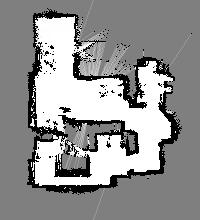

# GraphSLAM implementation for 2D LiDAR mapping
This project implements the GraphSLAM algorithm for indoor 2D mapping and grid-based localization methods.

The functions in the repository allow to perform a basic ICP-based GraphSLAM mapping. 
The detailed description of the algorithm can be found in my paper:

M. Kolakowski, 88“Automated Calibration of RSS Fingerprinting Based Systems Using a Mobile Robot and Machine Learning”88, 8Sensors8 , vol. 21, 6270, Sep. 2021 https://doi.org/10.3390/s21186270

Please cite the paper if you use the code for your work or research.

The scripts were primarily used with a robot consisting of:
* Dagu Wild Thumper 6WD platform
* Raspberry Pi 4
* two Pololu High-Power Simple Motor Controllers G2 18v15
* Scanse Sweep LiDAR

The code for the robot controller can be found at https://github.com/marckolak/wtController

